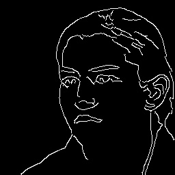
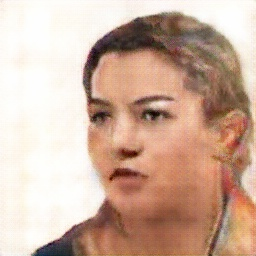
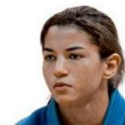
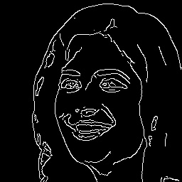
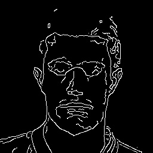
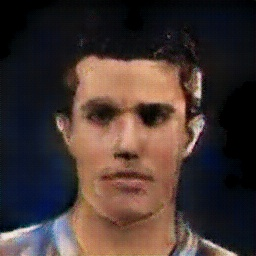
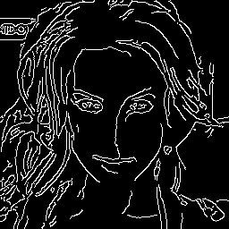
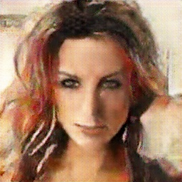
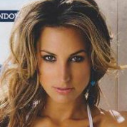

# ConditionalGAN - sketch2face
This is tensorflow implementation based on [pix2pix](https://phillipi.github.io/pix2pix/). I specifically tried to train the model to convert a human face sketch image to a photo-like image.

Need improvements:
It works for edges extracted from real photos, but not very well for hand-drawn sketch.

Differences from the paper:
- To avoid the fast convergence of discriminator, updated generator twice for each training step.  (Borrowed the idea from https://github.com/carpedm20/DCGAN-tensorflow)

## Output Example
After 2 epochs training, from randomly chosen test set:

| input | output | ground truth |
| :---: | :---: | :---: |
|  |  |  |
|  |  |  |
|  |  |  |
|  |  |  |

## Data
[CelebA](http://mmlab.ie.cuhk.edu.hk/projects/CelebA.html)
Used first 99% of them (200,573 images) as a training set and the others (2,026 images) as a test set.

1. Crop and resize images into 256 x 256 (target image)
2. Extract edges from target images to get sketch images using opencv canny (input image)

## Usage
To download dataset and start training:
    
    $ python main.py --download_data=True
    
To train a model with downloaded data:

    $ python main.py
    
To test the model with a canvas UI:

    $ python main.py --mode=test

## Environment
- python (3.5.3)
- tensorflow-gpu (1.1.0)
- opencv-python (3.2.0)

- google-api-python-client (1.6.2)
- requests (2.13.0)
- tqdm (4.11.2)
